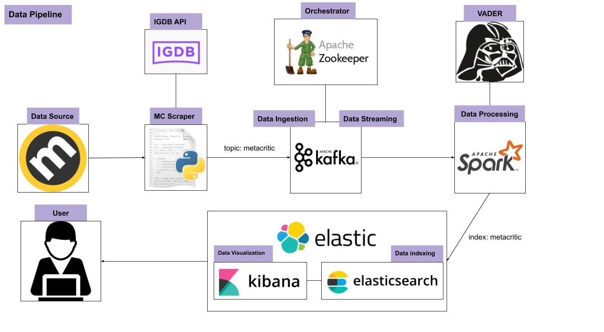

# Metacritic_review_analyzer

## What is this project?

The final goal of this project is analyze metacritic user's review about one or more game, to understand if there was event of review bombing.

### What is Metacritic?


Metacritic is a website that aggregates reviews of films, TV shows, music albums, video games and formerly, books. For each product, the scores from each review are averaged (a weighted average). Metacritic was created by Jason Dietz, Marc Doyle, and Julie Doyle Roberts in 1999. The site provides an excerpt from each review and hyperlinks to its source. 
A color of green, yellow or red summarizes the critics' recommendations. It is regarded as the foremost online review aggregation site for the video game industry.

### What is review bomb phenomenon?

A review bomb is an Internet phenomenon in which large groups of people leave negative user reviews online for a published work, most commonly a video game or a theatrical film, in an attempt to harm the sales or popularity of a product, particularly to draw attention to an issue with the product or its vendor.

## Who is this project for?

This project is for anyone who wants understand if the user's review of a particular game are reliable or not, and in the latter case, to find out the cause of the phenomenon 

## What i need to start?

Perform the following tasks

1. Download and install [docker](https://docs.docker.com/engine/install/)
2. Clone this repo  `$ git clone https://github.com/FoxAlex98/Metacritic_review_analyzer`
2. Download [Apache Kafka](https://www.apache.org/dyn/closer.cgi?path=/kafka/2.5.0/kafka_2.12-2.5.0.tgz) and move it in `kakfa/setup`
3. Download [Apache Spark](https://archive.apache.org/dist/spark/spark-2.4.6/spark-2.4.6-bin-hadoop2.7.tgz) and move it in `spark/setup`
4. Create a file `settings.yaml` in `metacritic_scraper/src/conf` with the same structure as `settings.yaml.dist` and insert your IGDM API key. If you don't have one you can get it [here](https://www.igdb.com/api)
5. Make sure all files have execute permission, else run:<br>
`
$ find ./ -type f -iname "*.sh" -exec chmod +x {} \;
`

## How it Works?

### Data Pipeline



## How to run it?

you can proceed in two ways

### Short way (less safe)

run: `$ bash /bin/start_all.sh`

then start metacritic scraper

run: 
```
$ cd /metacritic_scraper/bin/
$ bash ./start.sh
```
### Long way (more safe)

You need start each container. For each one you should wait for the end of logging

```
#Start Zookeeper
$ docker-compose up zookeeper

#Start Kafka
$ docker-compose up kafka

#Start Spark
$ cd spark/bin/
$ bash ./start.sh

#Start ElasticSearch
$ docker-compose up elasticsearch

#Start Kibana
$ docker-compose up kibana

#Start Metacritic Scraper
$ cd ../../metacritic_scraper/bin
$ bash ./start.sh

```

Anyway you should open this [link]("http://10.0.100.52:5601/") to open kibana <br> then natigate to dashboard to see the result of the analysis